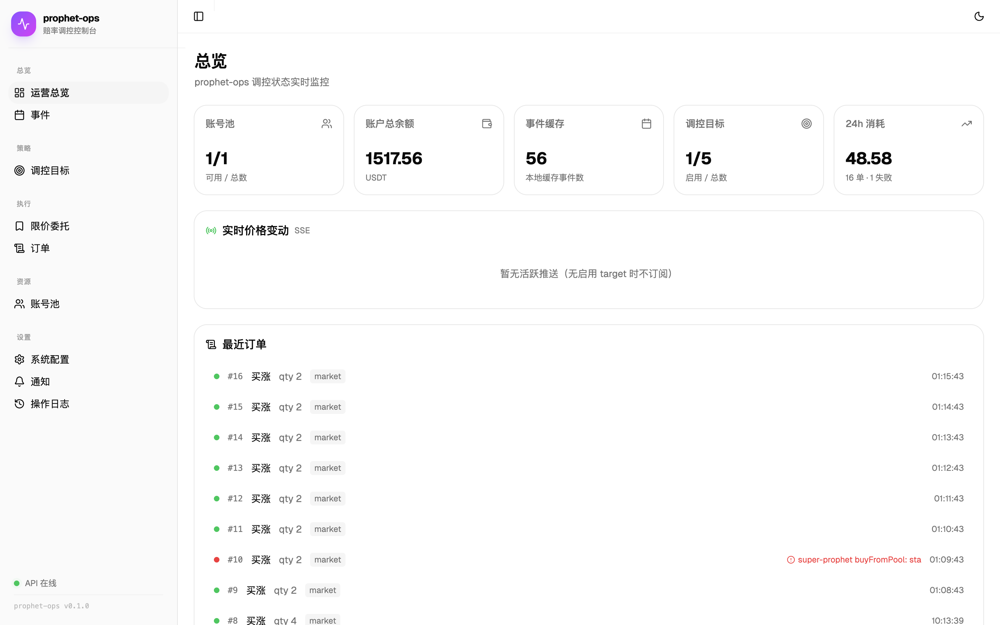
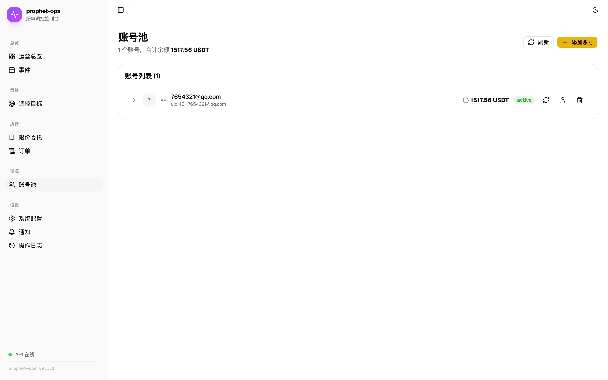
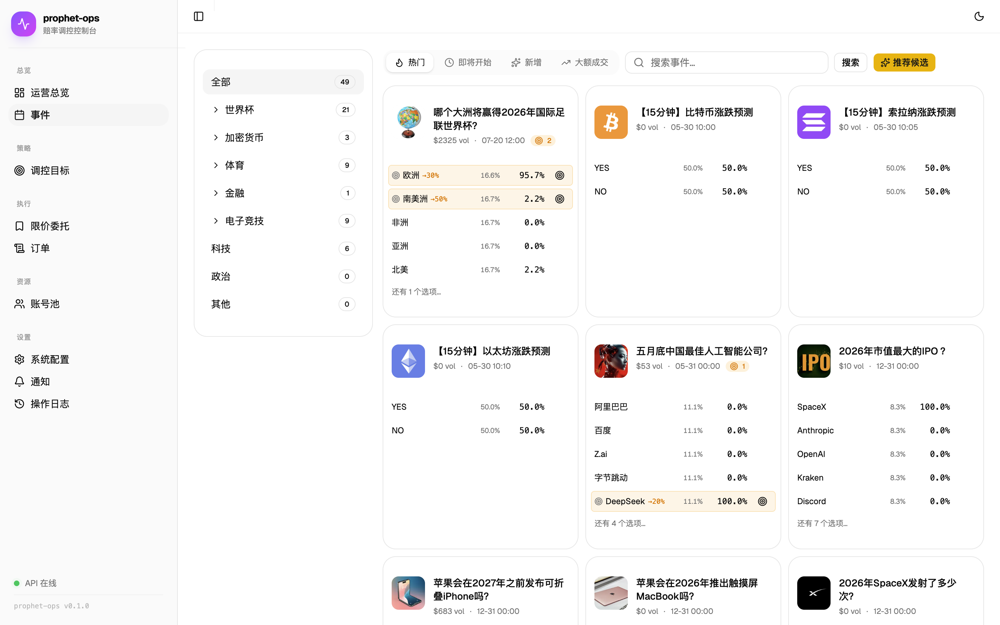
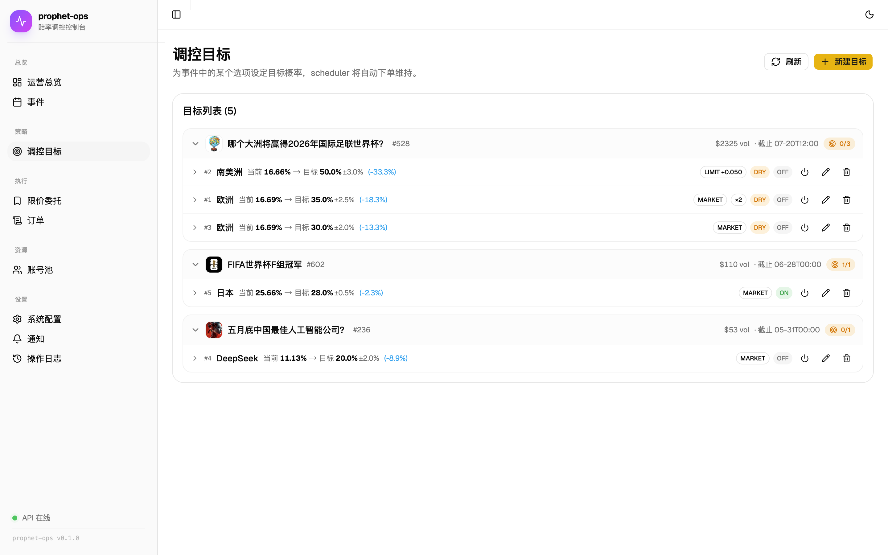
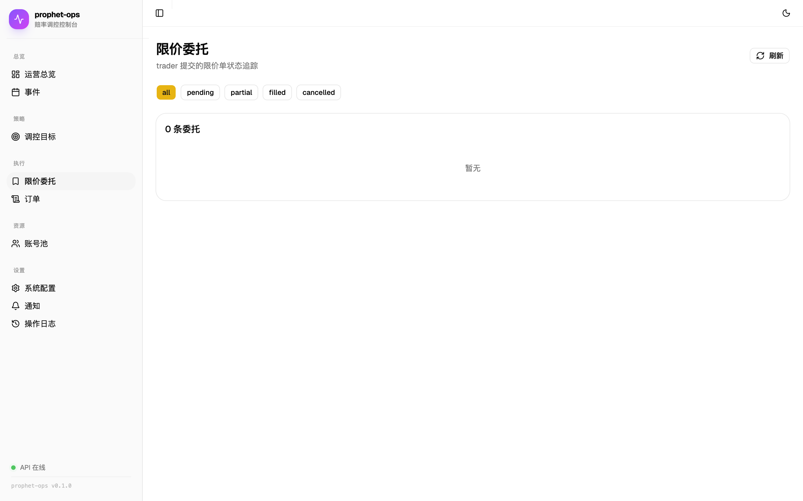
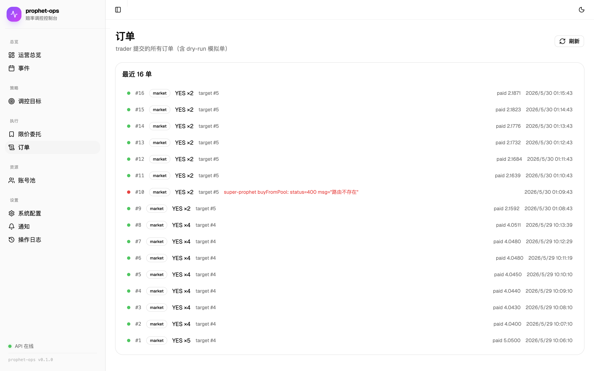
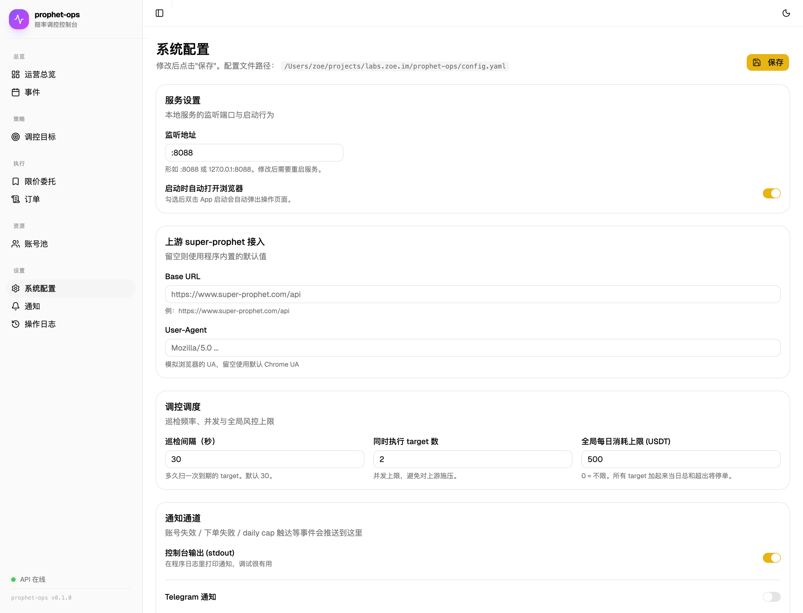

# prophet-ops 使用文档（运营版）

> 给运营同学的"看图说话"指南。**不需要懂代码**，跟着步骤点鼠标就行。
> 看不懂的字段直接跳过，等用顺了再回来研究。

---

## 目录

1. [安装与启动](#1-安装与启动)
2. [配置](#2-配置)
3. [页面与模块说明](#3-页面与模块说明)
   - [3.1 总览 Dashboard](#31-总览-dashboard)
   - [3.2 账号池 Accounts](#32-账号池-accounts)
   - [3.3 事件 Events](#33-事件-events)
   - [3.4 调控目标 Targets](#34-调控目标-targets)
   - [3.5 限价委托 Entrusts](#35-限价委托-entrusts)
   - [3.6 订单 Orders](#36-订单-orders)
   - [3.7 系统配置 Settings](#37-系统配置-settings)
4. [典型工作流](#4-典型工作流)
5. [常见问题 FAQ](#5-常见问题-faq)
6. [给开发者：API / 部署](#6-给开发者api--部署)

---

## 1. 安装与启动

### Windows：双击 .exe 启动（推荐运营使用）

1. 从 Release 页下载 `prophet-ops-windows-amd64.zip`（Apple Silicon Mac 远程开发可用 arm64 版）
2. 解压到任意目录（例：`D:\prophet-ops\`）
3. **第一次启动**：双击 `Prophet Ops.exe`
   - Windows Defender SmartScreen 可能拦截 → 点 **"更多信息"** → **"仍要运行"**
   - 通过一次后就不再询问
4. 浏览器自动打开 `http://127.0.0.1:8088`
5. **关闭浏览器不会停止服务**。要停止：
   - 浏览器内 **系统配置 → 退出服务**（推荐）
   - 双击解压目录里的 **`停止.bat`**
   - 任务管理器结束 `Prophet Ops` 进程

> 💡 **数据位置**：`%APPDATA%\prophet-ops\`
> 在文件资源管理器地址栏粘贴这一行就能打开。
> 卸载时删整个目录即可。

> ⚠️ 不要把 .exe 放进 `Program Files` 或其它需要管理员权限的目录，
> 否则程序写不了数据库 / 日志。普通用户目录就好。

### macOS：双击启动（推荐运营使用）

1. 从 Release 页下载 `prophet-ops-darwin.zip` 解压
2. 把 `prophet-ops.app` 拖到 **应用程序** 文件夹（也可以放桌面）
3. **第一次启动**：右键 → "打开" → 在系统警告框点 "打开"
   （macOS 对未签名应用会拦一次，确认之后就不再问了）
4. 程序会自动启动并打开浏览器到 `http://127.0.0.1:8088`
5. 关闭浏览器**不会**退出服务；要彻底关闭：
   - 浏览器内 **系统配置 → 退出服务**（推荐）
   - 活动监视器搜 `prophet-ops` kill 掉

> 💡 配置和数据库默认存在
> `~/Library/Application Support/prophet-ops/`
> 卸载时直接删除这个目录即可。

### 自己打包（开发者）

```bash
git clone <repo-url> prophet-ops
cd prophet-ops

# 单平台
./scripts/build-app.sh                       # 当前架构 → dist/prophet-ops.app
./scripts/build-app.sh universal             # macOS Intel + Apple Silicon

# 全平台一键
./scripts/build-release.sh                   # macOS + Windows + Linux 全打
./scripts/build-release.sh windows           # 只打 Windows
```

需要本地有 `go` (1.22+) 和 `node` (20+)。

### Linux / 命令行模式

```bash
./bin/prophet-ops             # 用 ~/.config/prophet-ops/config.yaml
./bin/prophet-ops --no-open   # 不自动开浏览器（适合服务器）
./bin/prophet-ops --config /path/to/config.yaml
```

---

## 2. 配置

**99% 的配置都可以在 "系统配置" 页面里改**，不用碰文件。下面这部分给好奇的同学。

配置文件位置（按优先级）：

| 平台 | 路径 |
|---|---|
| Windows | `%APPDATA%\prophet-ops\config.yaml` |
| macOS .app | `~/Library/Application Support/prophet-ops/config.yaml` |
| Linux | `~/.config/prophet-ops/config.yaml`（或 `$XDG_CONFIG_HOME/prophet-ops/`） |
| 命令行（找到当前目录有就用） | `./config.yaml`（便携模式） |
| 显式指定 | `--config /your/path.yaml` 或环境变量 `PROPHET_OPS_CONFIG` |

第一次启动如果文件不存在会**自动生成一份默认配置**。

完整字段对照（设置页 vs YAML）：

```yaml
server:
  addr: ":8088"          # 服务监听端口，改完需重启
store:
  driver: sqlite         # 暂时只支持 sqlite
  dsn: "data/prophet-ops.db"
ui:
  open_browser: true     # 启动是否自动开浏览器
notify:
  stdout: true           # 控制台打印通知
  telegram:
    enabled: false
    token: ""
    chat_id: ""
client:
  base_url: ""           # 留空用程序内置默认
  user_agent: ""
trader:
  tick_interval_sec: 30  # 多久扫一次 target
  max_concurrent: 2      # 同时跑几个 target
  global_daily_cap: 500  # 全局每日总消耗上限（USDT）
```

---

## 3. 页面与模块说明

启动后访问 [http://127.0.0.1:8088](http://127.0.0.1:8088)，左侧 6 个一级模块。

### 3.1 总览 Dashboard



**做什么**：进门第一眼，看清账户家底和今天发生了什么。

| 卡片 | 看什么 |
|---|---|
| **账号总数 / 总余额** | 池子里有几个号、加起来还能花多少 USDT |
| **今日订单数 / 今日消耗** | 真实消耗（不含 dry-run），离 global_daily_cap 还多远 |
| **活跃 target** | 当前正在巡检的调控数 |
| **概率快照** | 有 target 的 option 的最新概率，绿色/红色 = 与目标的偏差方向 |

> 💡 数字每 5 秒自动刷新，无需手动点。

---

### 3.2 账号池 Accounts



**做什么**：管理用来下单的真实账号。

#### 添加账号的三种姿势

点右上角 **"添加账号"** 按钮，弹窗里三个 Tab：

1. **邮箱 + 密码**（最简单）
   - 输入 super-prophet 的邮箱密码
   - 点登录 → 系统自动拉 token、头像、余额
   - 备注名可填可不填，留空就用 nickname

2. **邮箱验证码**
   - 输入邮箱 → 点"发送验证码"
   - 收到 6 位数字后填进去 → 登录

3. **直接粘贴 Token**（应急 / 已经有 JWT 的场景）
   - 把浏览器开发者工具里抓到的 `Authorization` header 整段粘进来

#### 列表每一行能干啥

| 列 | 说明 |
|---|---|
| 头像 / 备注名 | 双击备注名可改 |
| 状态 | 🟢 active 可用 · 🟡 invalid 失效 · ⚪ disabled 手动停用 |
| 余额 | 每 60 秒自动同步 |
| 余额曲线 | 鼠标悬停看走势，**异常突变会高亮** |
| 最近活跃 | 最近一次成功下单的时间 |

#### 单账号面板（点行展开）

- **余额历史曲线**：判断这个号有没有被异常消耗
- **该号的订单 / 委托**：只看这个账号的活动
- **手动操作**：刷新余额、停用、删除

#### 多账号是怎么自动分配的？

trader 派单时按你在 target 里设置的 `split_count` 决定：

| split_count | 选号策略 |
|---|---|
| `1`（不分散） | 最久没用的账号优先（LRU 轮转） |
| `2` 及以上 | 余额高的优先，从池子里选 N 个 |

资金分配两种策略（target 里 `split_strategy` 选）：
- **even**：N 个号平均分
- **weighted**：按余额加权（钱多多分）

> 如果某号余额不够它该分到的份额，系统会**自动把多出来的份额转给余额还有剩的号**，不会卡死。

---

### 3.3 事件 Events



**做什么**：浏览 super-prophet 上正在进行的事件，挑出要调控的对象。

#### 顶部操作

- **同步事件**：从上游拉一次（默认拉 50 个）。建议每天开工拉一次。
- **搜索框**：按标题模糊搜
- **分类过滤**：crypto / world_event / 自定义...

#### 列表

每个事件展示：封面图、标题、分类、起止时间、总成交量。

#### 点进事件详情

会看到该事件下所有 **赌注对象 (option)** 的列表：
- 选项名（如"是 / 否"或"荷兰 / 法国 / 德国 / ..."）
- 当前概率（0~1）
- 当前价格
- 池子规模

每个 option 右侧有 **"创建 Target"** 按钮 → 直接跳到 Targets 页预填好 event_option_id。

---

### 3.4 调控目标 Targets



**做什么**：核心功能。告诉程序"把这个 option 的概率维持在多少"。

#### 创建一个 target 要填什么

| 字段 | 中文 | 怎么填 |
|---|---|---|
| `event_option_id` | 关联对象 | 从事件页跳过来会自动填 |
| `target_probability` | 目标概率 | 0~1 之间。例：想让"荷兰夺冠"概率维持 30%，填 `0.30` |
| `tolerance` | 容差 | ±多少不动手。例 `0.02` = ±2% 内不下单 |
| `direction` | 方向 | `both`（双向调控） / `up`（只往上拉） / `down`（只往下压） |
| `mode` | 下单方式 | `market`（市价快） / `limit`（限价省手续费） |
| `limit_offset` | 限价偏移 | 限价模式下相对当前价的偏移。正数主动成交，负数被动挂单 |
| `max_per_order` | 单次上限 | 一次最多花多少 USDT |
| `max_per_day` | 单日上限 | 这个 target 当天最多花多少 |
| `split_count` | 分散账号数 | `1` = 单号；`>1` = 多号分散下单 |
| `split_strategy` | 分账策略 | `even` 平均 / `weighted` 按余额 |
| `check_interval_sec` | 巡检间隔 | 多久检查一次，默认 300 秒 |
| `enabled` | 是否启用 | 关掉 = 暂停 |
| `dry_run` | 演练模式 | **强烈建议新 target 先开！** 只记录不真下单 |

#### 列表展示

每行 = 一个 target。展开能看到：

- **概率折线图**：实时 vs 目标 + 容差带（绿色区域）
- **最近 10 单**：哪些号、什么时候、花了多少
- **下一次巡检倒计时**

#### 三个开关每个都救过命

1. `dry_run`：先开它跑两小时，看日志确认决策合理再关
2. `enabled`：要紧急止损直接关，不删 target、保留配置
3. `max_per_day`：硬上限，比 global 更细

---

### 3.5 限价委托 Entrusts



**做什么**：当 target 用 `mode=limit` 下单时，单子不会马上成交，会进上游的"委托列表"。

#### 列表

- 状态：🟡 pending / 🟢 filled / 🔵 partial / ⚪ cancelled
- 显示：账号、side、数量、限价、已成交量
- 右侧 **撤单按钮** — 一键撤掉本地+上游

#### 自动巡检 (Reconciler)

每 60 秒后台会自动：
1. 拉每个号的活动委托 (`getUserEntrusts`)
2. 拉最近订单历史 (`getOrderHistory`)
3. 把本地状态对上 → 部分成交 / 完全成交 / 被撤都自动更新

所以你看到的列表**不需要手动刷**。

---

### 3.6 订单 Orders



**做什么**：所有下单记录的总账本（含 dry-run 模拟单）。

#### 过滤器

- 按 target_id：只看某个调控
- 按 account_id：只看某个账号
- 按状态：success / failed / pending

#### 每行展示

| 列 | 说明 |
|---|---|
| 时间 | 下单时刻 |
| Target | 哪个调控触发的 |
| 账号 | 用哪个号下的 |
| 模式 | market / limit / **dry_run**（灰色） |
| Side | yes / no |
| 数量 / 单价 / 总价 | 实际成交 |
| 概率前 / 概率后 | 这一单**实际把概率推动了多少** |
| 状态 | ✅ success / ❌ failed（鼠标悬停看错误原因） |

#### 失败单怎么办

最常见原因：
- `余额不足` → 给账号充值或临时停用
- `quantity too small` → 调大 max_per_order
- `token invalid` → 该账号去 Accounts 页重新登录

---

### 3.7 系统配置 Settings



**做什么**：可视化改 `config.yaml`，不用碰命令行；同时是退出服务的入口。

> ✅ **改完点右上角"保存"。配置文件路径会显示在标题下方。**
> 通知通道、调度参数、上游 URL 改完**立即生效**，端口需要重启。

#### 服务设置
- **监听地址**：`:8088` = 所有网卡，`127.0.0.1:8088` = 只本机
- **启动时自动打开浏览器**：双击 .app 自动跳页面

#### 上游 super-prophet 接入
- **Base URL**：默认走内置的 `https://www.super-prophet.com/api`，正常不用改
- **User-Agent**：留空用 Chrome UA。被风控可以试试换

#### 调控调度
- **巡检间隔**：默认 30 秒。比 target 的 check_interval 小才有意义
- **同时执行 target 数**：默认 2。target 多了可以加，但小心被风控
- **全局每日消耗上限**：所有 target 加起来当日总和；`0` = 不限。**强烈建议设一个**

#### 通知通道
- **控制台 stdout**：调试时开
- **Telegram**
  1. 找 `@BotFather` 创建 bot 拿到 token
  2. 跟新 bot 发一条消息
  3. 访问 `https://api.telegram.org/bot<token>/getUpdates` 找到 `chat.id`
  4. 填进设置 → 点 **"发送测试消息"** → 在 Telegram 收到 ✅ 就 OK
  5. 点保存

会推送的事件：
- 账号 token 失效
- 单笔下单失败
- 触达 daily cap
- 限价单成交 / 撤销

#### 退出服务（红色卡片）
- Windows / macOS 通用
- 点击 → 二次确认 → 服务在 0.2 秒后停止
- 适合不想去任务管理器找进程的用户
- 退出后浏览器会断开连接，重新双击启动器即可恢复

---

## 4. 典型工作流

### 场景 A：开工第一天

1. **添加账号**：3~5 个号充好 USDT 后陆续登录进来
2. **配置通知**：Settings → Telegram → 测试通过 → 保存
3. **设全局风控**：Settings → 调控调度 → global_daily_cap 填一个能接受的数字
4. **同步事件**：Events 页点"同步事件"
5. **找目标**：在 Events 里挑要调控的对象
6. **建第一个 target（dry-run）**：先把 `dry_run` 勾上，让程序跑 2~4 小时
7. **看 Orders 演练记录**：确认决策合理 → 关掉 dry_run 真投

### 场景 B：日常维护

- 早上：看 Dashboard 余额变化、Orders 失败单
- 巡查异常：Accounts 看是否有号变 invalid
- 行情变化：调整 target 的 `target_probability` 或 `tolerance`
- 收盘：检查日消耗是否符合预期

### 场景 C：紧急止损

1. Dashboard 看到异常 → 立刻去 Targets 页
2. 把疑似有问题的 target `enabled` 关掉
3. 真出大事：Settings → 关掉 `telegram.enabled` 别炸群，把 `global_daily_cap` 设成 0（=不下单）
4. 排查完再恢复

---

## 5. 常见问题 FAQ

**Q: Windows Defender SmartScreen 拦下了打不开？**
- 点 **"更多信息"** → **"仍要运行"**。这是因为我们没买代码签名证书（≈ 5000 元/年），不是真的有问题。
- 公司有杀毒软件可能直接删 .exe，需要联系 IT 加白名单（路径或 SHA256）。

**Q: Windows 双击 .exe 没反应？**
- 看 `%APPDATA%\prophet-ops\prophet-ops.log`（地址栏粘贴打开）
- 端口被占用 → 设置页改 `server.addr` 或在任务管理器结束占用进程
- 杀软静默拦截 → 加白名单

**Q: Windows 怎么开机自启？**
- 按 `Win + R` 输入 `shell:startup` 回车
- 在打开的目录里放 `Prophet Ops.exe` 的快捷方式
- 下次开机自动启动

**Q: 双击 .app 没反应？（macOS）**
- 第一次：右键 → "打开"（不是直接双击）。Gatekeeper 会拦一次
- 端口已被占用：Settings 改 `server.addr` 或 kill 旧进程

**Q: 浏览器打开是空白页 / 404？**
- 等 1~2 秒服务起来再访问
- 如果一直空白：看 `/tmp/prophet-ops.log` 或控制台 Console.app 搜 "prophet-ops"

**Q: 账号显示 invalid 还能用吗？**
- 不能。trader 不会用 invalid 账号下单
- 去 Accounts 页用同邮箱重新登录，会自动刷新 token

**Q: 钱都没花，target 一直 skipped？**
- 检查 `enabled=true`、`dry_run=false`
- 检查实时概率与目标的差是不是在 tolerance 内（正常行为，差太小就不动）
- 检查账号池有没有 active 号

**Q: 想把所有 target 全停又不想删？**
- 简单粗暴：Settings → max_concurrent = 0 → 保存 → trader 不会派任何单
- 优雅：每个 target 单独 disable

**Q: 数据库在哪？怎么备份？**
- Windows：`%APPDATA%\prophet-ops\data\prophet-ops.db`
- macOS：`~/Library/Application Support/prophet-ops/data/prophet-ops.db`
- Linux：`~/.config/prophet-ops/data/prophet-ops.db`
- 关掉程序后直接复制一份即可
- 想看里面数据：用 `DB Browser for SQLite`（免费 GUI）打开

**Q: 想搬到另一台机器？**
- macOS：拷整个 `~/Library/Application Support/prophet-ops/` 过去
- Windows：拷整个 `%APPDATA%\prophet-ops\` 过去
- 跨平台搬也行，只要把 `data/prophet-ops.db` 放到目标机器的对应目录
- 账号 token 跟着搬，不用重新登录

---

## 6. 给开发者：API / 部署

### API 清单

| Endpoint | Method | 用途 |
|---|---|---|
| `/api/health` | GET | 健康检查 |
| `/api/settings` | GET/PUT | 读写配置 |
| `/api/settings/test-telegram` | POST | 测试 telegram |
| `/api/accounts` | GET/POST | 列表 / 添加（原始） |
| `/api/accounts/login` | POST | 密码登录 |
| `/api/accounts/token` | POST | token 提交 |
| `/api/accounts/email-code/send` | POST | 发邮箱验证码 |
| `/api/accounts/email-code/login` | POST | 验证码登录 |
| `/api/accounts/{id}` | PUT/DELETE | 更新 / 删除 |
| `/api/events` | GET | 缓存的事件 |
| `/api/events/sync` | POST | 拉取上游 |
| `/api/events/{id}/options` | GET | 事件下的对象 |
| `/api/targets` | GET/POST | target 列表 / 创建 |
| `/api/targets/{id}` | PUT/DELETE | 更新 / 删除 |
| `/api/orders` | GET | 订单（支持 ?target_id=&account_id=&status=） |
| `/api/entrusts` | GET | 委托列表 |
| `/api/entrusts/{id}/cancel` | POST | 撤单 |
| `/api/livefeed` | GET (SSE) | 实时推送 |

### 服务器部署（launchd / systemd）

macOS launchd：

```bash
./scripts/install.sh install        # 装到 ~/Library/LaunchAgents
./scripts/install.sh status
./scripts/install.sh logs
./scripts/install.sh uninstall
```

服务名 `im.zoe.prophet-ops`，开机自启 + KeepAlive。

### 数据导出

```bash
sqlite3 ~/Library/Application\ Support/prophet-ops/data/prophet-ops.db
sqlite> SELECT * FROM orders WHERE created_at > strftime('%s','now','-1 day');
```

迁到 mysql/postgres：实现 `internal/store/Store` 接口即可，业务层不动。

### 风险与合规

- 平台底部声明"禁止中国大陆用户使用"，**部署位置请自行评估**
- 这是市场调控工具，对外暴露需考虑合规
- 默认 `dry_run=true`，必须显式打开
- token 是高敏感凭证，`config.yaml` 和 db 文件**不要**提交版本库
- 强烈建议设置 `trader.global_daily_cap` 兜底
